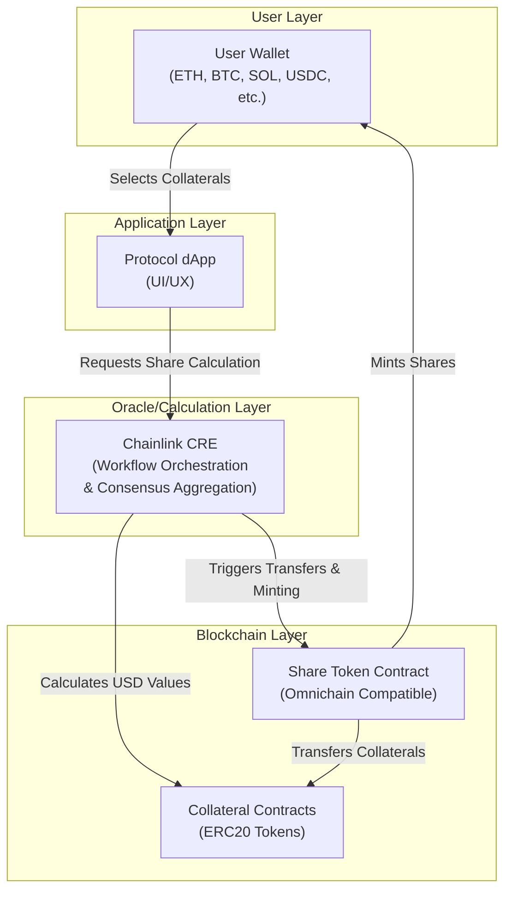
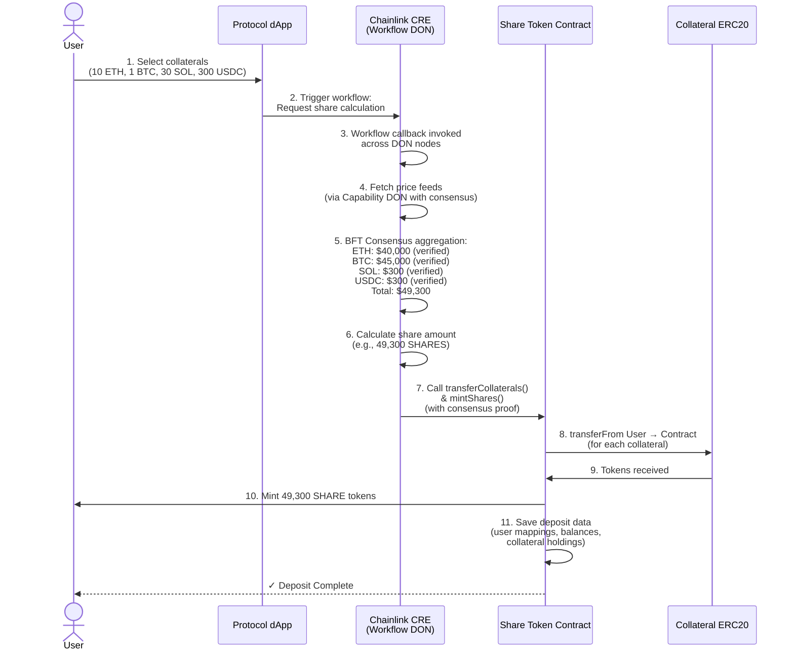
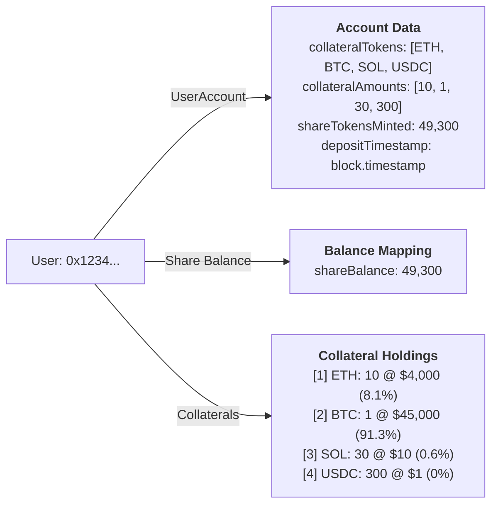
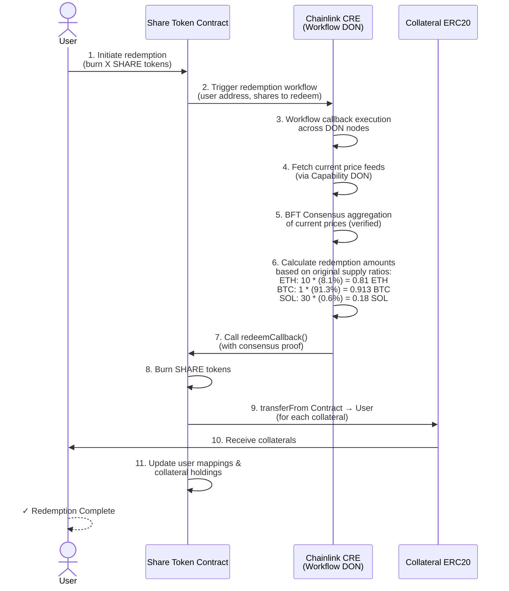

# Unified Share Token for Multiple/Dynamic Collateral

## Overview

A protocol that allows users to deposit multiple types of collateral (ETH, BTC, SOL, USDC, etc.) across different blockchains and receive a unified **SHARE token** in return. The system leverages **Chainlink CRE (Chainlink Runtime Environment)** to orchestrate and calculate fair share allocation based on consensus-verified USD valuations of supplied collaterals.

---

## System Architecture

### Core Components



---

## Data Structures

### Share Token Contract

```solidity
// User account information
mapping(address => UserAccount) userAccounts;

// User balance tracking
mapping(address => uint256) shareBalance;

// Collateral holdings per user
mapping(address => CollateralHolding[]) userCollaterals;

// Supported collaterals
mapping(address => bool) supportedCollaterals;

struct UserAccount {
    address[] collateralTokens;      // List of collateral types deposited
    uint256[] collateralAmounts;     // Amounts of each collateral
    uint256 shareTokensMinted;       // Total shares issued
    uint256 depositTimestamp;        // When deposit was made
    bool isActive;                   // Account status
}

struct CollateralHolding {
    address tokenAddress;            // Token contract address
    uint256 amount;                  // Amount held
    uint256 usdValue;                // USD value at deposit time
    uint256 originalRatio;           // User's original supply ratio
}
```

---

## User Deposit Workflow

### Step-by-Step Flow



---

## Data Storage Example

When a user deposits (10 ETH, 1 BTC, 30 SOL, 300 USDC):



---

## Redemption Workflow

### Redeeming Shares Back to Original Collaterals



---

## Key Features

### 1. **Multi-Chain Support**
- Share token is omnichain compatible (e.g., via LayerZero, IBC)
- Users can deposit collaterals from different blockchains
- Single unified SHARE token across all chains
- CRE orchestrates operations across multiple blockchains

### 2. **Decentralized Consensus-Based Valuation**
- Chainlink CRE fetches price feeds via Capability DON (Decentralized Oracle Network)
- Byzantine Fault Tolerant (BFT) consensus aggregates results from independent nodes
- Multiple independent nodes verify every price feed and calculation
- Share calculation based on consensus-verified USD values
- Eliminates single points of failure (no reliance on single API provider)

### 3. **Workflow Orchestration**
- CRE workflows coordinate complex multi-step operations
- Trigger-and-callback model simplifies business logic development
- Stateless execution ensures deterministic and reproducible results
- Automatic consensus for every capability invocation
- Workflow DON monitors triggers and coordinates execution across Capability DONs

### 4. **Flexible Collateral Mix**
- Users can deposit any supported collateral
- Dynamic collateral composition per user
- Original supply ratios preserved for redemption

### 5. **Deposit Data Persistence**
- Contract stores all user deposits
- Tracks collateral composition
- Maintains redemption ratios

### 6. **Transparent Redemption**
- Redemption honors original supply ratios
- Value-based redemption calculation using consensus-verified pricing
- No slippage on collateral mix

---

## Example Scenario

### User's Journey

**Initial Holdings:**
- 10 ETH @ $4,000 each = $40,000
- 1 BTC @ $45,000 each = $45,000
- 30 SOL @ $10 each = $300
- 300 USDC @ $1 each = $300
- **Total Value: $49,300**

**Step 1: Supply Collaterals**
```
User selects all holdings to supply
DApp sends to CRE: [10 ETH, 1 BTC, 30 SOL, 300 USDC]
```

**Step 2: CRE Calculation**
```
ETH: 10 * $4,000 = $40,000 (81.08%)
BTC: 1 * $45,000 = $45,000 (91.26%)
SOL: 30 * $10 = $300 (0.61%)
USDC: 300 * $1 = $300 (0.61%)
Total USD Value: $49,300
Shares Minted: 49,300 SHARES (1:1 ratio with USD value)
```

**Step 3: Contract Execution**
```
- Transfer 10 ETH from User → Contract
- Transfer 1 BTC from User → Contract
- Transfer 30 SOL from User → Contract
- Transfer 300 USDC from User → Contract
- Mint 49,300 SHARES to User
- Save all deposit data
```

**Step 4: Later Redemption (6 months later)**
```
User redeems 24,650 SHARES (50% of holdings)

Redemption amounts (based on original ratios):
- ETH: 5 ETH (50% of 10)
- BTC: 0.5 BTC (50% of 1)
- SOL: 15 SOL (50% of 30)
- USDC: 150 USDC (50% of 300)

Note: Collateral prices may have changed, but user receives
same collateral mix as original supply
```

---

## Contract Functions

### Share Token Contract

```solidity
// Deposit collaterals and mint shares
function depositCollaterals(
    address[] calldata collaterals,
    uint256[] calldata amounts
) external returns (uint256 sharesIssued)

// Redeem shares back to original collaterals
function redeemShares(
    uint256 sharesToBurn
) external returns (
    address[] memory collaterals,
    uint256[] memory amounts
)

// Get user's deposit information
function getUserAccount(address user) 
    external 
    view 
    returns (UserAccount memory)

// Get user's current share balance
function balanceOf(address user) 
    external 
    view 
    returns (uint256)

// Check user's collateral holdings
function getUserCollaterals(address user)
    external
    view
    returns (CollateralHolding[] memory)
```

### Chainlink CRE Integration

CRE executes workflows that orchestrate price fetching, consensus aggregation, and contract calls via callback pattern:

```solidity
// Called by CRE workflow callback to transfer collaterals and mint shares
// priceData contains BFT-verified consensus proof from Capability DON
function transferCollateralsAndMintShares(
    address user,
    address[] calldata collaterals,
    uint256[] calldata amounts,
    uint256 shareAmount,
    bytes calldata priceData  // Consensus-verified price proof
) external onlyCREWorkflow verifyConsensusProof(priceData)

// Called by CRE workflow callback to handle redemptions
// Receives verified price data from consensus aggregation
function redeemSharesCallback(
    address user,
    uint256 sharesToBurn,
    address[] calldata collaterals,
    uint256[] calldata amounts,
    bytes calldata priceData  // Consensus-verified price proof
) external onlyCREWorkflow verifyConsensusProof(priceData)
```

**CRE Workflow Example (TypeScript SDK):**

```typescript
// Deposit workflow - triggered by HTTP request
handler(
  httpTrigger.trigger({ endpoint: "/deposit" }),
  async (runtime: Runtime<Config>) => {
    // Step 1: Fetch prices from multiple independent nodes (Capability DON)
    // CRE automatically aggregates results via BFT consensus
    const priceResult = await runtime.invoke("price_fetch_capability", {
      tokens: ["ETH", "BTC", "SOL", "USDC"]
    })
    
    // prices are BFT-consensus verified across all DON nodes
    const prices = priceResult.consensus_result
    
    // Step 2: Calculate shares based on consensus prices
    const shareAmount = calculateShares(
      deposits,
      prices
    )
    
    // Step 3: Call contract with consensus proof
    // CRE ensures proof authenticity across DON
    await runtime.invoke("evm_write_capability", {
      contract: "ShareTokenAddress",
      function: "transferCollateralsAndMintShares",
      args: [
        userAddress,
        collateralArray,
        amountArray,
        shareAmount,
        priceResult.consensus_proof  // BFT verified
      ]
    })
    
    return { success: true, sharesIssued: shareAmount }
  }
)

// Redemption workflow - triggered by blockchain event
handler(
  evmLogTrigger.trigger({
    contract: "ShareTokenAddress",
    event: "RedemptionInitiated"
  }),
  async (runtime: Runtime<Config>) => {
    // Fetch latest prices with consensus
    const priceResult = await runtime.invoke("price_fetch_capability", {
      tokens: ["ETH", "BTC", "SOL", "USDC"]
    })
    
    // Calculate redemption amounts based on original ratios
    const redemptionAmounts = calculateRedemption(
      userAccount,
      sharesToBurn,
      priceResult.consensus_result
    )
    
    // Call contract redemption callback
    await runtime.invoke("evm_write_capability", {
      contract: "ShareTokenAddress",
      function: "redeemSharesCallback",
      args: [
        userAddress,
        sharesToBurn,
        collateralArray,
        redemptionAmounts,
        priceResult.consensus_proof
      ]
    })
    
    return { success: true, collateralsRedeemed: redemptionAmounts }
  }
)
```

---

## Benefits

| Benefit | Description |
|---------|-------------|
| **Unified Exposure** | Single token representing diverse collateral basket |
| **Consensus-Verified Pricing** | CRE ensures accurate USD-based pricing via BFT consensus |
| **Flexibility** | Users can supply any mix of supported collaterals |
| **Cross-Chain** | Omnichain compatibility via CRE workflow orchestration |
| **Transparent** | All deposit and redemption data stored on-chain |
| **Decentralized** | No single points of failure - multiple independent nodes verify operations |
| **Preservation** | Original collateral ratios maintained for redemptions |

---

## Risk Considerations

1. **Data Source Quality**: Relies on quality of underlying data sources that CRE's Capability DONs aggregate
2. **Collateral Volatility**: Users exposed to collateral price changes between deposit and redemption
3. **Smart Contract Risk**: Potential bugs in Share Token contract or CRE workflow logic
4. **Consensus Delays**: BFT consensus aggregation may introduce minor execution delays
5. **Multi-Chain Bridges**: Bridge security for omnichain token transfers
6. **CRE Early Access**: Chainlink Runtime Environment is in Early Access development phase

---

## Conclusion

The Unified Share Token protocol provides a seamless way for users to create a diversified collateral portfolio through a single token. By leveraging **Chainlink CRE (Chainlink Runtime Environment)** as the orchestration layer, the system achieves:

- **Decentralized Consensus**: Every price feed and calculation is verified by multiple independent nodes via Byzantine Fault Tolerant consensus
- **Cross-Chain Coordination**: CRE workflows seamlessly orchestrate operations across multiple blockchains
- **Institutional-Grade Security**: Built-in security guarantees inherited from distributed consensus computing
- **Fair & Transparent**: On-chain records and consensus-verified pricing ensure complete transparency and eliminate single points of failure

This architecture transforms collateral management from a centralized oracle model to a fully decentralized, consensus-verified system suitable for institutional-grade smart contracts.
